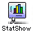
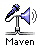
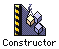

+++
title = "My Life as a Programmer"
+++

In which I admit that I’ve been around the block for a while …

_This article first appeared on my site in 1997. I took it down when I redesigned
the site sometime around 2001. It’s now 2018 and I’ve decided I miss it, so I dug
back in the archives and added it back._

### Geek Alert

This is a jargon-filled page. If you’re a programmer, enjoy! If not, well …
you might find this page pretty disappointing.

### The Early Years

I first put fingers to a computer keyboard more than twenty years ago (when
I could still count my age on my fingers!). **2018 update: This would now be more
than forty years ago.** 😳 My dad brought home one of the first Apple II
computers sold in the state of Iowa and I played Star Wars on it. Then I
started writing my own games, and discovered that the challenge of writing
software was much more interesting than searching out Klingons.

In junior high I experimented with all the hot new emerging personal
computer stuff: CP/M, Z-80 processors, and AppleSoft BASIC. I eagerly
awaited the latest issue of _Byte_ magazine, because it would surely
have some interesting program code in it that I could type in and hack
apart. Back in those days, people were as likely to “copyleft”
their code as copyright it. A BASIC interpreter took five pages.

In 1981 or so, my teachers encouraged me to enter a statewide student
programming contest. I put together a gradebook program in a few weeks and
sent it in. I then had my first brush with “look and feel” issues – long
before Apple and Microsoft duked it out. The gradebook program looked so
convincingly like the just-released Visicalc that contest judging was delayed
while the judges consulted with Visicorp to ensure that I hadn’t swiped
any of their code. When they learned I hadn’t, they awarded me the
top state prize.

My first commercial software success was a joint venture with my dad. We
wrote a banner program that we called “Sign-Up” for the Apple II
and IBM PC. Dad did the fonts; I did the user interface. We tried selling
it on our own … we sold a few dozen copies and discovered the joys of
being developer, tech support, and marketer all at once. When we had a 2am
call from an irate customer at home, we called it off.

Fortunately, Sunburst Communications, an educational software publisher,
decided to publish it for us. They repackaged Sign-Up as “The
Professional Sign Maker” and sold it to schools and teachers across
the country.

Flush with this success, I rewrote the program from the ground up in my
senior year of high school. I found an algorithm for fast conic-spline
curve drawing in a research journal, and implemented it in 6502 assembly
language. I tweaked and tweaked until I could advertise what I’m sure was
a rare thing: fast scalable fonts on a processor with three 8-bit
registers. Sunburst released it in 1986 as the Super Sign Maker. The
royalties from this software paid for a large part of my undergraduate
education.

It sold until 1996.

From 1987 until about 1993, I played around with programming quite a
bit, but I didn’t think I was going to make a career of programming. I
completed a bachelors degree in psychology and worked as a free-lance
graphic designer for the fun of it. My main work was as a statistical
consultant for the University of Minnesota.

### Recent Stuff

In 1993, I started work on a tool that we would use at U of M for doing
interactive statistical presentations. We needed a custom front-end for
the mainframe stats package that we were using (SPSS). I first looked into
modifying NCSA Telnet for our purposes. But the code was just too messy.
(Little did I know then that I would eventually meet its authors and work
right across the street from their offices -- and then later hire one of
them.)

So I wrote my own Telnet. I was consumed. I worked 60- and 70-hours weeks in
a mad coding frenzy in July. (My job was supposedly 3/4 time.) Friends
wondered if I had fallen off the planet. StatShow was born late in July
and became a primary analysis tool in the office where I worked. This was
when I knew I had to make a career shift.

Later in 1993, I released the first version of TurboTCP, a networking
library I had written before StatShow and tested while writing it. It was
my first entry into the popular Internet freeware/shareware culture. I
loved it. People from all kinds of interesting places used it and wrote to
me with their suggestions. Two early users (Brian and Dan, you know who
you are!) became important friends and mentors.

**Hint to aspiring programmers:** If you see something missing from
your favorite operating system, class library, whatever... _write it!_
Somebody else probably wishes the same thing were out there. Put the
source out on the Internet, make sure people can get in touch with you,
and listen to their suggestions! Don’t expect to make scads of money (or
even _any_ money), but what you’ll learn from talking with your
users will be invaluable.

TurboTCP and my test applications were all written using the Think Class
Library. When the first PowerPC Macintoshes were released in March 1994, I
bought one a week later. (I still own the 6100. I installed MkLinux on it
and used it as my mail server and a second web server for testing new site
for several years.) Eager to try my hand at writing native applications and
the spiffy new CodeWarrior compiler, I wrestled with the question of how to
compile TCL 2.0 with CodeWarrior. Jon Wätte had already ported the older TCL
(version 1.1.3) to CodeWarrior. I asked him about it and he said it couldn’t be
done.

That was all I needed: I was convinced he was wrong, so I decided to do
it. It wasn’t easy. I fell off the face of the earth again for about three
weeks. But when it was done, I could compile TCL with the DR/2 version of
CodeWarrior. In May I released a kit that patched the TCL sources to my
version. It was an instant success. Over the course of that year, I talked
with a few hundred developers who were using the kit and forged a
relationship with Metrowerks that proved to be far more important my
career than I ever could have anticipated.

Later in 1994, I left Minnesota to attend the University of Illinois
where I almost completed a masters in computer science. For my first year
there, I worked with [Charley Kline](https://twitter.com/cvkline) as a
research assistant.

Charley had written a nifty little program called **Maven,** which allowed you
to use a Macintosh on the Internet as a voice conferencing tool. About the time
I was arriving at U of I, parts of Maven were being incorporated into
CU-SeeMe, a videoconferencing tool from Cornell. So in the wonderful ways
that universities work, I got funded for a year of nothing but
programming.

Maven was a great program for testing my skills: since it runs in
real-time, almost everything is done at interrupt level on the Macintosh.
So a lot of my time was spent deep in the bowels of the programming,
recovering from weird crashes I had caused and poking around in MacsBug.
Over the course of the year, I pretty much completely rewrote Maven. You
can download the latest version <strike>here</strike>. By the way, neither
Charley nor I are working on Maven any longer. **(2018 update: I don’t
believe Maven is available for download any more. And where would you find a
Mac that could run it? Oh, except for that PowerMac 6100 that is still around
gathering dust in my closet?)**

## Metrowerks

By some combination of right time, right place, right skills, I became the
lead author of Metrowerks’ Constructor in April of 1995. Constructor is
the visual interface builder for the PowerPlant framework. It was a
wonderful growth experience for me: I got the chance to develop many of my
ideas and philosophies about user interface design, and I got a lot of
feedback from my peers in the industry. (There’s something rather
invigorating about having customers who truly understand the nature of
your work.) Somehow that work distracted me from my academic pursuits
(can’t imagine how!), and I left Illinois in the fall of 1995 to return to
my long-time home of Saint Paul, Minnesota. For the next year and a half,
I worked for Metrowerks as a telecommuter from Minnesota.

## Adobe

Early in 1997, I was shown an embroyonic new graphics application that
was being developed in [Adobe Systems’](https://www.adobe.com/)
Northwoods office (conveniently located in the northern suburbs of Saint
Paul). Given my dual background as graphic artist and software engineer, I
was immediately attracted to this product and after much cajoling, I convinced
the folks at Adobe that hiring me would be a good idea (… or did they convince
me?). The embroyo has since hatched, and is now known as Adobe ImageReady
(now a part of [Adobe Photoshop](https://www.adobe.com/products/photoshop.html)).
My web site and ImageReady evolved together. I started using ImageReady to build
the graphics for this site early in its development cycle, and those experiences
were very influential in shaping the final product.

## 2018 Update

As I mentioned at the start of this page, it’s now been two decades since I wrote
the original article.

ImageReady has been off the market for several years now. Parts of it have been
subsumed into Photoshop.

As happens, I’ve moved on and been parts of many other projects. In almost 22 years
at Adobe, I’ve been part of more than a dozen projects that have started from scratch.
Several have made it to market; some have not.

By far, the highlight of my career has been the ability to serve serious photographers
as part of the team that originally brought Lightroom to market in 2007. That work has
afforded me the opportunity to meet some of the most preeminent photographers and graphic
designers of this era. I couldn't be more grateful for that. I’ve also had the
opportunity to work with and learn from many talented developers, architects, and
user-experience designers in my time here.

I’m no longer part of the team that’s building Lightroom. I’m sad about that, but
I still have the opportunity to build great software. I look forward to sharing
what I’m building currently.
